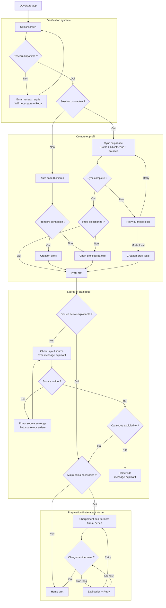

# Workflow Mermaid - Accueil / Entree App (Version professionnelle)

## Intent

Cette version vise une lecture plus produit et plus executive du parcours d'entree.
Elle conserve les decisions importantes sans melanger tous les details d'implementation.

## Mermaid

## Notes

- `Home` n'apparait qu'une fois l'etat juge suffisant.
- En cas de source valide mais vide, `Home` s'affiche quand meme avec un message explicatif.
- Le flow TV par QR code reste volontairement hors de ce diagramme.
