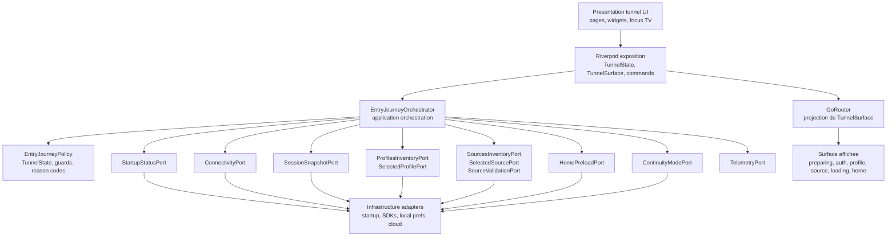

# Schema d'architecture cible - Tunnel d'entree

## Objectif

Donner une vue d'ensemble compacte de l'architecture cible retenue en phase 3, pour servir:
- de schema de reference
- de support de discussion implementation
- de rappel des frontieres entre couches

Ce schema ne remplace pas les sous-phases `3.1` a `3.6`. Il les synthesize.

## Vue logique



## Vue par couches

## 1. Presentation

Contient:
- pages tunnel
- composants UI
- focus TV
- providers UI-specifiques

Observe:
- `TunnelState`
- `TunnelSurface`
- `TunnelCommandsFacade`

Ne fait pas:
- calcul de parcours
- lecture directe des repositories cloud

## 2. Application

Contient:
- `EntryJourneyOrchestrator`
- use cases de progression du tunnel
- mapping `TunnelState -> TunnelSurface`

Observe:
- snapshots et results des ports

Publie:
- `TunnelState`
- reason codes
- commands de progression

## 3. Domain

Contient:
- `TunnelState`
- `TunnelStage`
- `TunnelReasonCode`
- `TunnelCriteriaSnapshot`
- `EntryJourneyPolicy`
- ports du tunnel

Ne connait pas:
- Flutter
- Riverpod
- GoRouter
- Supabase

## 4. Data / Infrastructure

Contient:
- repositories concrets
- adapters des ports
- preferences persistantes
- preload `home`
- auth/cloud/network SDKs

Ne fait pas:
- arbitrage du parcours
- choix de surface UI

## Vue de composition

```text
GetIt
  -> assemble repositories, adapters, ports, preload services, orchestrator

Riverpod
  -> expose orchestrator, TunnelState, TunnelSurface, commands

GoRouter
  -> projette TunnelSurface en navigation compatible

UI tunnel
  -> consomme state et emet des intentions
```

## Vue de migration

Ordre retenu:

1. introduire `TunnelState`
2. introduire `EntryJourneyOrchestrator`
3. brancher `TunnelSurface` dans le routeur
4. migrer les surfaces UI
5. retirer les ponts legacy

Ponts legacy temporaires autorises:
- `BootstrapDestination`
- `AppLaunchStateRegistry`
- `LaunchRedirectGuard` historique

## Regles de lecture rapide

- une seule source de verite: `TunnelState`
- un seul moteur de parcours: `EntryJourneyOrchestrator`
- un seul role pour le routeur: projeter et proteger
- un seul role pour l'UI: afficher et emettre des intentions
