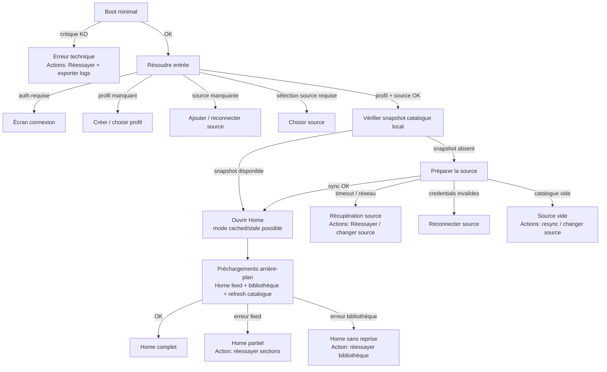

# Roadmap refactor boot

## Objectif

Refondre le démarrage pour supprimer les blocages génériques du type
`Impossible de préparer la page d'accueil`.

Chaque échec doit mener à une action claire :

- réessayer ;
- se connecter ;
- créer ou choisir un profil ;
- ajouter, choisir, reconnecter ou resynchroniser une source ;
- ouvrir Home en mode partiel quand les données non critiques échouent ;
- exporter les logs quand le problème est technique.

## Diagnostic actuel

Le démarrage mélange aujourd'hui plusieurs responsabilités dans un même tunnel :

- bootstrap système : config, dépendances, logging ;
- décision d'entrée : auth, profil, source ;
- préparation métier : catalogue IPTV, Home feed, bibliothèque ;
- navigation finale ;
- affichage d'erreur.

Le problème principal est que certains échecs récupérables sont traités comme
des échecs bloquants de Home :

- timeout réseau IPTV ;
- catalogue vide après refresh ;
- erreur provider IPTV ;
- `HomeState.error` pendant le preload ;
- `homeState.iptvLists.isEmpty` avec source active ;
- timeout de `homeInProgressProvider`.

Ces cas ne doivent plus aboutir à un mur générique. Ils doivent ouvrir une
surface de récupération ou un Home partiel.

## Principe cible

Le démarrage doit être divisé en deux machines d'état :

1. **EntryDecision**
   Décide où envoyer l'utilisateur.

2. **HomeReadiness**
   Décide quel niveau de contenu Home est disponible.

Home ne doit pas dépendre de la réussite complète des preloads. Il doit dépendre
d'un minimum métier :

- profil résolu ;
- source résolue ;
- catalogue local exploitable, ou écran de préparation/récupération source.

## Flux cible



## Modèle d'état proposé

### EntryDecision

```dart
sealed class EntryDecision {
  const EntryDecision();
}

final class OpenHome extends EntryDecision {
  const OpenHome({
    required this.profileId,
    required this.sourceId,
    required this.catalogMode,
  });

  final String profileId;
  final String sourceId;
  final CatalogMode catalogMode;
}

final class RequireAuth extends EntryDecision {
  const RequireAuth({required this.reasonCode});
  final String reasonCode;
}

final class RequireProfile extends EntryDecision {
  const RequireProfile({required this.reasonCode});
  final String reasonCode;
}

final class RequireSource extends EntryDecision {
  const RequireSource({required this.reasonCode});
  final String reasonCode;
}

final class RequireSourceSelection extends EntryDecision {
  const RequireSourceSelection({required this.reasonCode});
  final String reasonCode;
}

final class TechnicalBootFailure extends EntryDecision {
  const TechnicalBootFailure({
    required this.reasonCode,
    required this.message,
  });

  final String reasonCode;
  final String message;
}
```

### HomeReadiness

```dart
enum CatalogMode {
  fresh,
  cached,
  stale,
  unavailable,
  empty,
}

sealed class HomeReadiness {
  const HomeReadiness();
}

final class HomeReady extends HomeReadiness {
  const HomeReady({required this.catalogMode});
  final CatalogMode catalogMode;
}

final class HomePartial extends HomeReadiness {
  const HomePartial({
    required this.catalogMode,
    required this.reasonCode,
    required this.actions,
  });

  final CatalogMode catalogMode;
  final String reasonCode;
  final List<RecoveryAction> actions;
}

final class SourceRecoveryRequired extends HomeReadiness {
  const SourceRecoveryRequired({
    required this.reasonCode,
    required this.actions,
  });

  final String reasonCode;
  final List<RecoveryAction> actions;
}
```

### RecoveryAction

```dart
enum RecoveryAction {
  retry,
  exportLogs,
  login,
  createProfile,
  chooseProfile,
  addSource,
  chooseSource,
  reconnectSource,
  resyncSource,
  openHomeCached,
  retryHomeSections,
  retryLibrary,
}
```

## Mapping erreurs vers solutions

| Erreur actuelle | Nouvelle destination | Actions |
| --- | --- | --- |
| `configTimeout`, `dependenciesInitTimeout` | erreur technique | réessayer, exporter logs |
| `configInvalid`, `dependenciesInitFailed` | erreur technique | réessayer, exporter logs |
| session absente | auth | se connecter |
| session expirée / reauth required | auth | se reconnecter |
| profils vides | profil | créer profil |
| sélection profil invalide | profil | choisir profil |
| aucune source locale/cloud | source | ajouter source |
| plusieurs sources sans sélection valide | source selection | choisir source |
| source sélectionnée absente | source selection | choisir source |
| `iptvNetworkTimeout` | récupération source | réessayer, changer source |
| `iptvProviderError` route/DNS/TLS | récupération source | réessayer, changer source |
| credentials invalides | récupération source | reconnecter source |
| `iptvEmptyData` | récupération source | resync, changer source |
| catalogue local absent | préparation source | sync, puis récupération si échec |
| catalogue local stale | Home | ouvrir Home cached, sync background |
| `homePreloadInvalidState` causé par feed | Home partiel | retry sections |
| `libraryPreloadTimeout` | Home partiel | retry bibliothèque |

## Roadmap

### Phase 1 - Clarifier les contrats

- Créer les modèles `EntryDecision`, `HomeReadiness`, `CatalogMode` et
  `RecoveryAction`.
- Ajouter un mapper unique `StartupRecoveryMapper`.
- Remplacer les messages génériques par des `reasonCode` stables.
- Documenter les invariants :
  - boot critique peut bloquer ;
  - auth/profil/source route vers une action ;
  - feed/bibliothèque ne bloquent pas Home ;
  - catalogue sans snapshot local route vers préparation source.

### Phase 2 - Sortir la décision d'entrée de l'orchestrateur legacy

- Extraire la logique auth/profil/source de `AppLaunchOrchestrator`.
- Construire un service pur `ResolveEntryDecision`.
- Garder l'orchestrateur actuel comme adaptateur temporaire.
- Vérifier que les destinations actuelles restent supportées :
  - `auth` ;
  - `welcomeUser` ;
  - `welcomeSources` ;
  - `chooseSource` ;
  - `home`.

### Phase 3 - Revoir le contrat catalogue

- Ajouter une lecture explicite du snapshot local :
  - existe ;
  - contient des playlists ;
  - contient des items ;
  - âge / fraîcheur éventuel.
- Ne lancer un refresh bloquant que si aucun snapshot exploitable n'existe.
- Si refresh échoue sans snapshot, router vers récupération source.
- Si snapshot existe, ouvrir Home et lancer refresh en arrière-plan.

### Phase 4 - Débloquer Home

- Supprimer les conditions bloquantes suivantes du chemin de lancement :
  - `homeState.error != null`;
  - `homeState.iptvLists.isEmpty` comme échec global ;
  - timeout de `homeInProgressProvider` comme échec global.
- Transformer ces erreurs en `HomePartial`.
- Ajouter une bannière Home actionnable pour les sections en erreur.
- Garder un écran récupération source dédié pour les cas catalogue/source.

### Phase 5 - Écrans de récupération

- Remplacer `LaunchErrorPanel` générique dans le tunnel par des surfaces
  spécialisées :
  - problème technique ;
  - préparation source ;
  - source indisponible ;
  - source vide ;
  - reconnexion requise.
- Chaque surface doit avoir au moins une action primaire utile.
- Ajouter une action secondaire `Exporter les logs` sur les erreurs techniques
  et les erreurs IPTV répétées.

### Phase 6 - Observabilité

- Logger chaque décision avec :
  - `reasonCode` ;
  - destination ;
  - actions proposées ;
  - présence snapshot catalogue ;
  - source sélectionnée redacted ;
  - mode local/cloud.
- Remplacer les logs ambigus `homePreloadInvalidState` par des raisons
  explicites :
  - `catalog_snapshot_missing`;
  - `catalog_sync_timeout`;
  - `catalog_empty`;
  - `home_feed_failed`;
  - `library_preload_timeout`.

### Phase 7 - Tests

- Tests unitaires sur `ResolveEntryDecision`.
- Tests unitaires sur `StartupRecoveryMapper`.
- Tests de lancement :
  - aucun profil ;
  - aucune source ;
  - plusieurs sources sans sélection ;
  - source sélectionnée invalide ;
  - snapshot catalogue disponible ;
  - snapshot absent + sync OK ;
  - snapshot absent + timeout ;
  - catalogue vide ;
  - feed Home en erreur ;
  - bibliothèque en timeout.
- Tests widget pour les surfaces de récupération et leurs focus.

## Critères d'acceptation

- Aucun chemin récupérable ne montre uniquement
  `Impossible de préparer la page d'accueil`.
- Toute erreur visible propose une action primaire.
- Home s'ouvre si un snapshot catalogue local exploitable existe.
- Les erreurs de feed et bibliothèque n'empêchent pas Home de s'afficher.
- Les erreurs source/catalogue sans snapshot ouvrent une récupération source.
- Les logs permettent d'identifier la cause sans lire la stacktrace.
- Le bouton retry relance uniquement l'étape concernée, pas forcément tout le
  bootstrap.

## Fichiers probablement concernés

- `lib/src/core/startup/app_launch_orchestrator.dart`
- `lib/src/core/startup/app_startup_gate.dart`
- `lib/src/core/startup/domain/tunnel_state.dart`
- `lib/src/features/welcome/presentation/pages/splash_bootstrap_page.dart`
- `lib/src/features/welcome/presentation/providers/bootstrap_providers.dart`
- `lib/src/features/home/presentation/providers/home_providers.dart`
- `lib/src/features/home/presentation/widgets/home_error_banner.dart`
- `lib/src/core/widgets/launch_error_panel.dart`
- `lib/src/core/storage/repositories/iptv_local_repository.dart`

## Risques

- Ouvrir Home trop tôt peut produire un écran vide si le contrat catalogue est
  mal défini.
- Les états partiels peuvent se multiplier si le mapping d'erreurs n'est pas
  centralisé.
- Le local-first peut masquer un problème cloud réel si les logs ne sont pas
  explicites.
- Les actions de récupération doivent être testées au focus, surtout TV/remote.

## Décision recommandée

Ne pas réécrire tout le tunnel d'un coup.

Commencer par introduire les modèles et le mapper, puis déplacer
progressivement les conditions bloquantes vers des états récupérables. Le
premier gain produit doit être la suppression du blocage Home sur :

- erreur feed ;
- erreur bibliothèque ;
- catalogue local stale mais exploitable.
